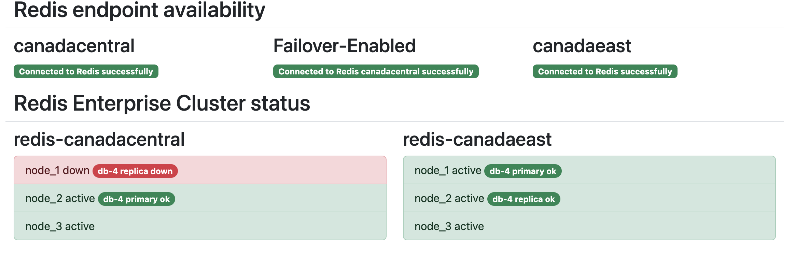
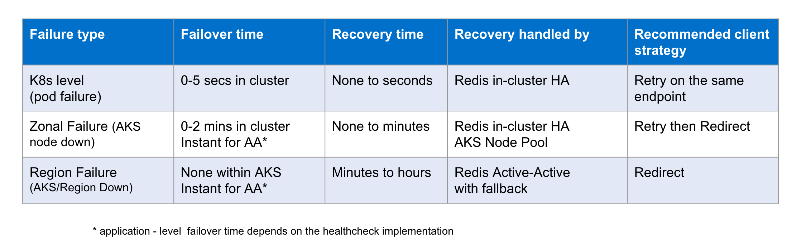

# Deploying Redis Enterprise Active Active on AKS

This repo contains deployment scripts and web monitoring dashboard for Active Active Redis Enterprise deployment in two Azure Regions.



## Prerequisites and Configuration

### Azure subscription and CLI

You need t be able to successfully authenticate your azure cli to the Azure Subscription:
```
az login
```

### Azure DNS Zone

Redis Enterprise ActiveActive requires FQDN (NOT the public IP) of the ingress services for both participating clusters. In your Azure Subscription create DNS Zone and make sure it resolvable by the public DNS. You might use subdomain of the existing domain hosted elsewhere.

The following ENV variables in the `config.sh` and `flask/app.py` need to point to your DNS record and the resource group where this record lives.
```
DNS_ZONE=demo.umnikov.com
DNS_RESOURCE_GROUP=anton-rg
```

### Azure regions

Terraform and bash scripts use Azure region name as both cluster and region identifiers. Make sure your subscription has access and sufficient Quota to provision 3 node cluster in each of the regions. By default, nodes used for AKS cluster are Standard_D4_v5 (4 vcpu, 16GB ram). You can change the node type in `variables.tf` file.

Adjust `variables.tf` `config.sh` and `flask/app.py` files:

```
# config.sh
CLUSTER1=redis-eastus
CLUSTER2=redis-canadacentral
```
```
//variables.tf
variable "region2" {
  type        = string
  default     = "canadacentral"
  description = "Region 2 of the AA deployment"
}
```
```
# flask/app.py
region2="canadaeast"
dns_suffix="demo.umnikov.com"
```

### Resource groups

Terraform scripts would create a resource group to deploy AKS clusters. Default name is `anton-rg-aa-aks`You can change that name in `variables.tf` file. This group is temporary and is destroyed upon `terraform destroy`. This resource group is different from the `DNS_RESOURCE_GROUP` that should exist and contain DNS record.

### Software

You need to have the followin software installed:

- az CLI
- Terraform
- kubectl
- helm
- jq (jquery)
- python3

## Setup

### 1. Provision AKS clusters

```
terraform apply
```
Process typically takes 3-5 minutes.

### 2. Setup Redis Enterprise

```
bash setup-haproxy.sh
```
This scripts configures Ingress controller, Redis Enterprise Operator, Redis Webhook and creates Redis Enterprise Cluster in `rec` namespace. 

It would also load kubect cluster definitions into the kubectl kubeconfig file, so you can access both participating clusters.

Setup itself usually takes less then a minute, but starting up Redis Enterprise pods within a cluster can take  up to 5-10 minutes.
```
"BootstrappingFirstPod"
"Initializing"
"Running"
```

As the status message turns to `"Running"` you can stop the script with ^C and proceed to the next step.

### 3. Establish Active-Active connection between the clusters
```
bash setup-rerc.sh
```
This script would prepare RERC (Redis Enterprise Remote Cluster) resources and corresponding secrets and then load them into two participating clusters.

You can inspect the generated resources under the `./yaml` folder. The same script would create (but not load!!!) Redis Enterprise Active Active Database (REAADB) resource as `./yaml/crdb.yaml`

### 4. Create Redis Active Active Database

```
kubectl apply -n rec -f yaml/crdb.yaml
```

Assuming previos steps went well you should be able to successfully create the Active Active Database

## Troubleshooting

### Resources not fully provisioned

`setup-haproxy.sh` might give errors such as `Error from server (NotFound): secrets "admission-tls" not found` - these are results of attempring to access resource that has not finished provisioning. Usually just restarting the bash script is enough to fix it.

### Collecting logs

```
bash test.sh
```

Would collect logs and k8s resource statuses from various components of the setup in `./logs` folder.

Alternatevely you can use Log Collector as described here: https://docs.redis.com/latest/kubernetes/logs/collect-logs/

### Redis Cluster Status

```
kubectl config use-context redis-canadacentral
kubectl exec -it  -n rec  rec-redis-canadacentral-0 -- bash
rladmin status
```
## Web Dashboard


To enable Web UI for the demo run:
```
python3 flask/app.py
```
and point your browser to `http://localhost:5000/`


## Testing access to the cluster

Adjust test.py file to use selected regions and dns name:
```
region1="canadacentral"
region2="canadaeast"
dns_suffix="sademo.umnikov.com"
```

Run test:
```
python3 test.py
```
This simple woul connect to Redis DB endpoints in both regions and measure:
- avg ping time for endpoints in both regions
- replication speed between the regions
- Speed of setting large (6Mb keys)

While it's possible to execute this test on your own laptop, it is recommended to run it in the region, designated as "region1". It would demostrate difference in the responce (ping) time between local and remote region and will test large keys with the local region.


To test access from the redis command line `redis-cli` use:
```
# Canada Central
redis-cli --tls -h crdb-anton-db.redis-canadacentral.sademo.umnikov.com -p 443  --insecure --sni crdb-anton-db.redis-canadacentral.sademo.umnikov.com

# East US
redis-cli --tls -h crdb-anton-db.redis-eastus.sademo.umnikov.com -p 443  --insecure --sni crdb-anton-db.redis-eastus.sademo.umnikov.com
```

You can execute comands such as:
```
# run in canadacentral
set hello-from canada

# run in eastus
get hello-from
canada 
```

## Testing High Availability and Disaster Recovery

```
bash chaos.sh
```
would build up the commands specific to your environment (but not execute them!!!) that you can use in the next following steps.

### Forcing the k8s level (pod) failure

To simulate k8s level failure - force delete one of the redis enterprise pods.
```
kubectl delete pod rec-redis-canadacentral-0 -n rec --force
```

### Emulating single node failure

To emulate a failure of a single node you can forse restart one of the nodes of the AKS cluster.
```
az vmss restart  --name vmss \
--resource-group MC_ANTON-RG-AA-AKS_REDIS-CANADACENTRAL_CANADACENTRAL \
--instance-ids 1
```

With Replication enabled node restart even should be totally transparent to the application and the user. Note: application should be attempting reconnect in case of connection interruption (for instance - using `retry_on_error` conection flag in Python).

### Emulating Region outage

To emulate the entire Region outage you can stop and restart the AKS cluster in that region. For example:
```
az aks stop --name redis-canadacentral --resource-group anton-rg-aa-aks
# wait for the cluster to stop

az aks start --name redis-canadacentral --resource-group anton-rg-aa-aks
# wait for cluster to get back online
```

While the one of the clusters is down - make sure that you still can access and set/retreive data from the cluster in another region.

Since full cluster outage is also a loss of quorum (more than 50% of Redis Cluster nodes are down) recovery involves two additional steps on the Redis side:
```
# Recover from loss of quorum
kubectl -n rec patch rec rec-redis-canadacentral --type merge --patch '{"spec":{"clusterRecovery":true}}'
watch "kubectl -n rec describe rec | grep State"
# wait for "Running" state


# Recover databases
kubectl exec -it  -n rec  rec-redis-canadacentral-0 -- rladmin recover all
```
Make sure you can access clusters in both regions and data entered another region during the outage is accasibble in the region recoverd from the outage.

The following table summary of potential outage types:



